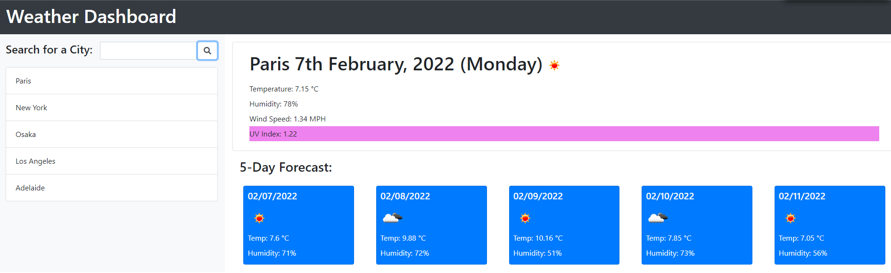

# Weather-Dashboard

## Deploy link
https://aurorachama.github.io/Weather-Dashboard

## Purpose
The purpose of this webpage is to create a web application which serve as a Weather Dashboard.

## User Guide
* User would be shown a search form upon entering the webpage

* Users can then search the weather of the city by typing the name of the city (inside the input area of the form at the left land side)

* The blue button **Search** is the interaction for an user to search the weather

* Upon pressing the **Search** button, the input would be saved **locally** via JavaScript and today's weather(includes UV index), 5 Day's(including today) forecast and an search result (maxium of 5) will be displayed respectfully

__________________________________________

|Today's weather | Right Hand side|
|---|---|
| 5 Day forecast  |Right Hand side under Today's weather  |
| search result  | Left hand side under Search  |

## Stored Item
* The stored item would not disappear after page refreshes, and would be automatically loaded every time the page refreshes.

## Third-party & Server API used
* JQuery  
https://jquery.com/
* Bootstrap  
https://getbootstrap.com/
* Moment.js  
https://momentjs.com/
* Open Weather Map (One Call API)  
https://openweathermap.org/
## Screenshot

